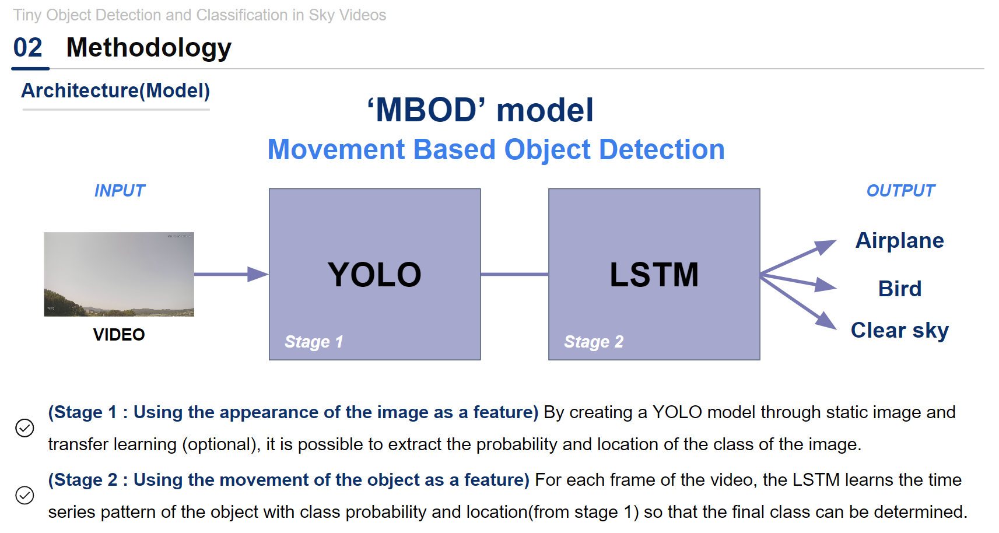
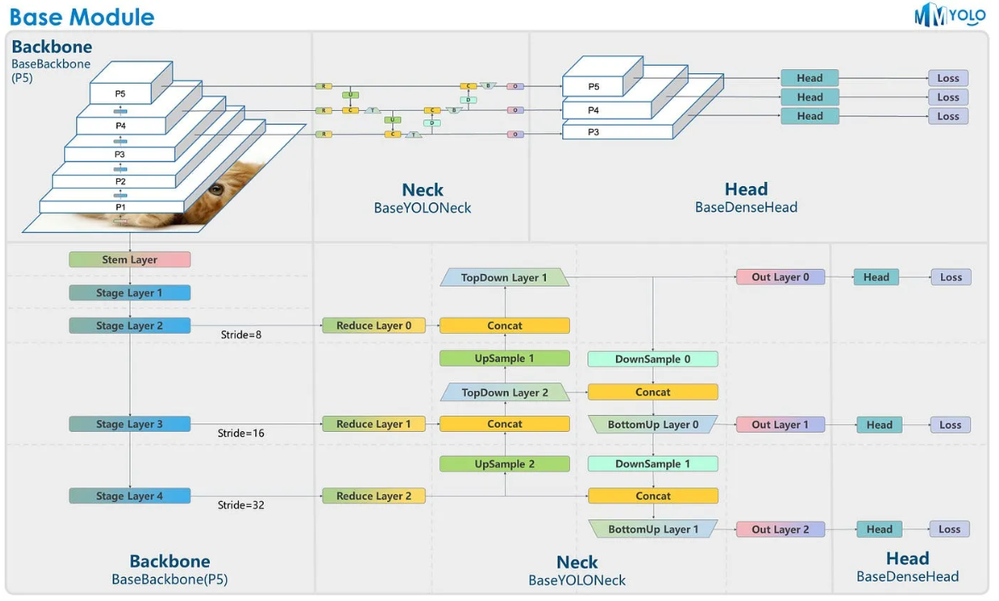

# CS570-Project
In this project, we utilize the Yolov8 model from Ultralytics, and pretrain them on object detection task. We also develop LSTM model that feature the object tracking from Yolo to see if it improves the performance. Finally, we implemented data augmentation method from VideoMix that we apply on privately owned dataset.

# Notable Results
| Task                                                              | Accuracy | F1 Score |
|-------------------------------------------------------------------|----------|----------|
| Video classification - pretrained + LSTM with augmented data      | 0.814    | 0.600    |
| Full object detection - pretrained + LSTM with augmented data     | 0.530    | 0.434    |
| Binary object detection - pretrained + LSTM with non-augmented data | 0.777    | 0.603    |
| Full object detection - pretrained + Finetuning + LSTM with augmented data  | 0.814    | 0.479    |
| Binary object detection - pretrained + Finetuning + LSTM with augmented data | 0.777    | 0.494    |

# Environment Requirements:
* Torch
* OpenCV
* SciPy
* ultralytics
* Pillow
* matplotlib
* scikit-learn

# File Category:
- **Data Augmentation**
  - VideoMix.py
  - VideoTransform.py
  - augment.py
  - dataset.py

- **Object Tracking for YOLO**
  - object_tracking/custom_yolo/
  - object_tracking/track_checker.py
  - object_tracking/track_extraction.py
  - object_tracking/yololstm.py
  - object_tracking/lstm_train.py
  - model.py

- **Finetuning**
  - YOLO_training.ipynb
  - convert_baseline.ipynb
  - custom_yolo.py
  - inference-video.ipynb

- **Bias Testing and Data Distribution**
  - bias_testing.ipynb
  - custom_eval.py
  - plotter.ipynb
